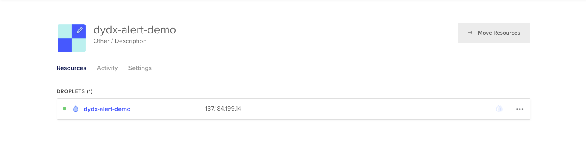

# Running a Virtual Machine on Digital Ocean
*Note: This tutorial is intended for mac and linux users. If you are working from a windows station, everything will still work, however you will need to take slightly different steps when accessing your virtual machine via secure shell (ssh).*

**Instructions**
1. Open an account on [digitalocean.com](https://www.digitalocean.com/).
2. Click the "+ New Project" button on the left-hand side panel, and name the new project "dydx-alert-bot-demo". If DigitalOceal asks you to move resources to it, click "Skip for now".
3. In the "dydx-alert-bot-demo" project, click the "Create" tab in the top right, and select "Droplets" ("Droplets" are the digital ocean term for "virtual machine"). You should now be on a screen that allows you to configure the droplet. Set the following options:
    * Image: Ubuntu 20.04
    * Plan: Basic Shared CPU with Regular Intel with 1 GB / 1 CPU. This is currently the cheapest option.
    * Datacenter: New York. This makes little difference for our purposes; the alerts bot has been successfully tested with "New York".
    * Authentication: Password. Set this to a password that you will remember!
    * Hostname: dydx-alert-demo
4. Wait while the virtual machine is initialized. Once it has loaded, click on the number that is separated by dots. This is the IP address of the virtual machine, and we will use it to access the machine. 
5. (meant for mac/linux users) Open up the terminal app on your computer. Copy the following text and paste it into your terminal window: `ssh root@IP_ADDRESS`, replacing `IP_ADDRESS` with the number you saw before. An example might look like the following: `ssh root@142.93.201.123`. If you see a question about an ECDSA key fingerprint, type `yes` and press enter. You should now see a prompt asking for a password; type (or paste) the password that you set when creating the droplet, then press "enter" once you finish typing the password. If this was successful, your terminal window should read `root@dydx-alert-demo:~#`. Now any command you enter into the terminal will be executed on the virtual machine!
